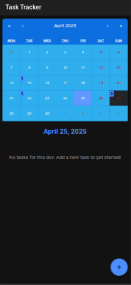
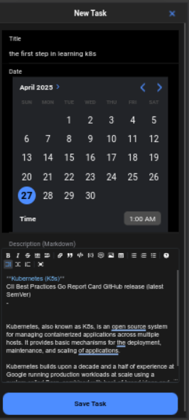
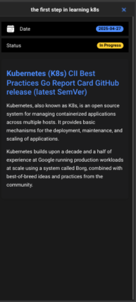

# Task Tracker App

A cross-platform mobile application built with Ionic and React for tracking tasks, managing schedules, and improving productivity.

## Features

- 📅 Calendar view to visualize tasks by date
- ✅ Create, edit, and delete tasks
- 📝 Rich text editing with Markdown support
- 🔔 Local notifications for task reminders
- 📱 Works on iOS, Android, and web
- 🌓 Supports light and dark mode
- 💾 Persistent storage using Ionic Storage

## Screenshots

<div align="center">





</div>

## Getting Started

### Prerequisites

- Node.js 16+
- npm or yarn
- Ionic CLI
- Android Studio (for Android development)
- Xcode (for iOS development)

### Installation

1. Clone the repository

   ```bash
   git clone [your-repo-url]
   cd myApp
   ```

2. Install dependencies

   ```bash
   npm install
   ```

3. Start the development server
   ```bash
   ionic serve
   ```

### Building for Native Platforms

#### Android

```bash
# Build the app
ionic build

# Add Android platform
ionic cap add android

# Copy web assets to the native project
ionic cap copy android

# Sync native project with plugins and dependencies
ionic cap sync android

# Open in Android Studio
ionic cap open android
```

#### iOS

```bash
# Build the app
ionic build

# Add iOS platform
ionic cap add ios

# Copy web assets to the native project
ionic cap copy ios

# Sync native project with plugins and dependencies
ionic cap sync ios

# Open in Xcode
ionic cap open ios
```

## Project Structure

```

.
├── capacitor.config.ts
├── cypress
│   ├── e2e
│   │   └── test.cy.ts
│   ├── fixtures
│   │   └── example.json
│   └── support
│       ├── commands.ts
│       └── e2e.ts
├── cypress.config.ts
├── docs
│   └── screenshots
│       ├── first-screen.png
│       ├── new-task.png
│       └── task-info.png
├── eslint.config.js
├── index.html
├── ionic.config.json
├── package.json
├── package-lock.json
├── public
│   ├── favicon.png
│   └── manifest.json
├── README.md
├── src
│   ├── App.test.tsx
│   ├── App.tsx
│   ├── components
│   │   ├── CalendarView.css
│   │   ├── CalendarView.tsx
│   │   ├── ExploreContainer.css
│   │   ├── ExploreContainer.tsx
│   │   ├── TaskDetail.css
│   │   ├── TaskDetail.tsx
│   │   ├── TaskForm.css
│   │   ├── TaskForm.tsx
│   │   ├── TaskList.css
│   │   └── TaskList.tsx
│   ├── main.tsx
│   ├── models
│   │   └── Task.ts
│   ├── pages
│   │   ├── Home.css
│   │   └── Home.tsx
│   ├── services
│   │   └── TaskService.ts
│   ├── setupTests.ts
│   ├── theme
│   │   └── variables.css
│   └── vite-env.d.ts
├── tsconfig.json
├── tsconfig.node.json
└── vite.config.ts

```

